# Green-Island-Final-Project

# 簡報markdown
完成後我應該會直接丟Gamma，確認一下內容：
1. 開發進程
   - 確認網站定位：目標受眾分析
   - 需求盤點與初步網站架構規劃：美術風格與wireframe設計
   - 前端開發：React & Vue + html
   - 後端開發：串接資料庫、碳排放計算機
   - 測試與優化
2. 網站規劃架構 (可以再改我先隨便打，原則上跟提案的差不多詳細得複習簡報)
   * 首頁
        - 左上角 logo + 綠島續嶼 || (首頁資料欄)
        - 最上面放大照片+這個網頁的簡易介紹(中間按鈕就是下方資訊跳轉)
         - 第一層: 綠島氣象資訊(天氣、溫度近七日資訊)
         - 第二層: 放一個綠島切分(鄉鎮)，做一個簡單的綠島互動，例如華到上面會顯示那個鄉鎮的簡介，(左邊綠島本島圖，右邊文字介紹)
         - 第三層:FAQ，關於我們
         - 底部:跟stitch一樣放一下頁尾
   - 綠島綠色觀光介紹
   - 交通方式簡介(結合碳排放計算)
   - 綠色旅遊路線／推薦行程
   - 景點與生態體驗介紹
   - 在地店家／友善商家資訊
   - 最新消息／活動資訊
   - 常見問答
   - 關於我們
3. 設計原則說明
   - 視覺上傳達「自然、生態、低碳、島嶼感」
   - 操作上強調「易懂、直覺、快速找到資訊」
   - 內容上兼顧「觀光吸引力」與「永續價值傳達」
   - 大圖搭配精簡文字，提升第一印象
   - 卡片式資訊模組，方便快速瀏覽
   - 以主題分類引導旅客規劃行程
4. 使用工具說明 (我目前亂打的)
   - Figma
   - ngrok (到時候再看要用甚麼佈署)
   - posatgreSQL
   - vscode
   - React & Vue
   - Version Control: GitHub

----- 我是分隔線-----
上面的內容報告完基本就可以刪了或是封存，下面才是真的.md檔該留的
# 網站架構
### 網站架構圖 (Sitemap)

```mermaid
graph TD
    %% 全域樣式設定
    classDef main fill:#f9f,stroke:#333,stroke-width:2px;
    classDef sub fill:#fff,stroke:#333,stroke-width:1px;

    Home[首頁 index] --> H1[Hero Banner 主視覺]
    Home --> H2[關於我們]
    Home --> H3[常見問答 FAQ]

    News[最新消息 / 活動資訊 news] --> N1[活動列表]
    News --> N2[活動詳情頁]

    Eco[綠島綠色觀光介紹 about-eco] --> E1[引言：生態環境概況]
    Eco --> E2[面臨問題與保育現況]

    Trans[交通方式簡介 transport] --> T1[各交通工具說明]
    Trans --> T2[碳排放計算工具]

    Itin[綠色旅遊路線 itinerary] --> I1[行程卡片與地圖整合]

    Attr[景點與生態體驗 attractions] --> A1[景點介紹]
    Attr --> A2[生態體驗活動]
    Attr --> A3[推薦旅宿]

    Shops[在地店家 / 友善商家 local-shops] --> S1[商家列表 可篩選分類]
    Shops --> S2[商家詳情]

    %% 套用樣式讓主選單更明顯
    class Home,News,Eco,Trans,Itin,Attr,Shops main;
```

# 前後端功能
(施工中...)

